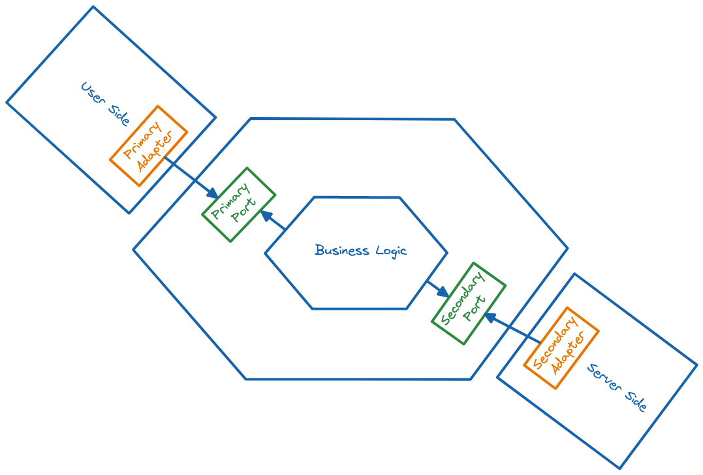

# @sefr/no-hexagonal-architecture-violation

## About the rule

Rule to check if Hexagonal architecture principles are respected. This rule doesn't require any additionnal configuration.

```json
{
  // ...
  "plugins": ["@sefr"],
  "rules": {
    "@sefr/no-hexagonal-architecture-violation": "error"
  }
}
```

If you plan to use that rule, you must follow the following folders conventions :

#### Example :

Considering the following code organization :

```
src
├─── user-side
│    ├── some-primary-adapter.ts
│    └── some-other-controller.ts
├─── core
│    ├── some-primary-port.ts
│    ├── some-secondary-port.ts
│    ├── some-model.ts
│    ├── some-service.ts
│    └── some-other-model.ts
└─── server-side
     ├── some-http-client.secondary-adapter.ts
     └── some-data-access-object.ts
```

There a few synonyms you can use for `core` as `business`, `business-logic`, `hexagon`...

The root folder doesn't matter anyway.

✅ ESLint will not report an error for the following code :

```typescript
/*
 Admit current file path is "src/user-side/some-primary-adapter.ts"
 */
import { SomePrimaryPort } from "../core/some-primary-port.ts";

export class SomePrimaryAdapter implements SomePrimaryPort {
	public doSomething(): void {
		// ...
    }
}
```

❌ ESLint will report an error for the following codes :

```typescript
/*
 Admit current file path is "src/user-side/some-primary-adapter.ts"
 */
import { SomePrimaryPort } from "../server-side/some-http-client.secondary-adapter.ts";

export class SomePrimaryAdapter implements SomePrimaryPort {
	public doSomething(): void {
		// ...
	}
}
```

Previous code allows to bypass the `core` of the application which can break rules you want to apply.

```typescript
/*
 Admit current file path is "src/core/some-primary-port.ts"
 */
import { SomeHttpClient } from "../server-side/some-http-client.secondary-adapter.ts";

const toto = new SomeHttpClient(/*...*/);
```

Previous code is violating the core principle of the hexagonal architecture by injecting technical logic among the 
business rules of the application.

## Hexagonal architecture principle

This architecture is about isolating core-business logic from application or infrastructure purposes. However, this 
architecture does not show a clear way to structure your core-business layer.


