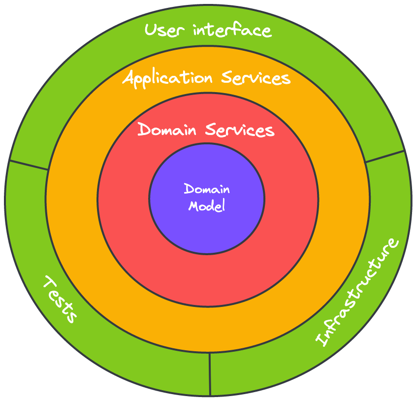

# @sefr/no-onion-architecture-violation

## About the rule

Rule to check if Onion architecture principles are respected. This rule doesn't require any additionnal configuration.

```json
{
  // ...
  "plugins": ["@sefr"],
  "rules": {
    "@sefr/no-onion-architecture-violation": "error"
  }
}
```

If you plan to use that rule, you must follow the following folders conventions :

#### Example :

Considering the following code organization :

```
src
├─── application-service
│    ├── some-service.ts
│    └── some-other-service.ts
├─── domain
│    ├── service
│    │   ├── some-domain-service.ts
│    │   └── some-other-domain-service.ts
│    └── model
│        ├── some-model.ts
│        └── some-other-model.ts
└─── infrastructure
     ├── some-http-client.ts
     └── some-data-access-object.ts
```

You can also set `domain-service` and `domain-model` at the same level as following :

```
src
├─── application-service
│    ├── some-service.ts
│    └── some-other-service.ts
├─── domain-service
│    ├── some-domain-service.ts
│    └── some-other-domain-service.ts  
├─── domain-model
│    ├── some-model.ts
│    └── some-other-model.ts
└─── infrastructure
     ├── some-http-client.ts
     └── some-data-access-object.ts
```

The root folder doesn't matter anyway.

✅ ESLint will not report an error for the following code :

```typescript
/*
 Admit current file path is "src/application-service/some-service.ts"
 */
import { doSomething } from "../domain/service/some-domaine-service.ts";

const toto: string = doSomething(true);
```

❌ ESLint will report an error for the following code :

```typescript
/*
 Admit current file path is "src/domain/service/some.domain-service.ts"
 */
import { doSomething } from "../application-service/some-application-service.ts";

const toto: string = doSomething(true);
```

## Onion Architecture principle

This architecture is about isolating core-business logic from application or infrastructure purposes.


